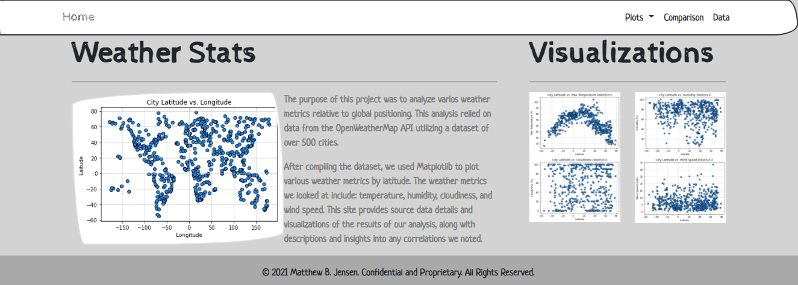

# Web Design Homework - Web Visualization Dashboard (Latitude)

This project is a Web visualization dashboard of key weather metrics in more that 500 cities around the world at various latitudes based on an earlier analysis conducted using pandas, numpy, matplotlib, scipy, and data obtained via an API call to OpenWeatherMap.org. The prior analysis is available here: https://github.com/mattbjensen/Python-API-Challenge

The dedicated site includes visualizations showing latitude versus temperature, humidity, cloudiness, and wind speed using HTML, CSS, and Bootstrap.

https://mattbjensen.github.io/Web-Design-Challenge/

- - -

## References

OpenWeatherMap.org. (2012). Сurrent weather and forecast. Retrieved from [https://openweathermap.org/](https://openweathermap.org/)

- - -

© 2021 Trilogy Education Services, LLC, a 2U, Inc. brand. Confidential and Proprietary. All Rights Reserved.
